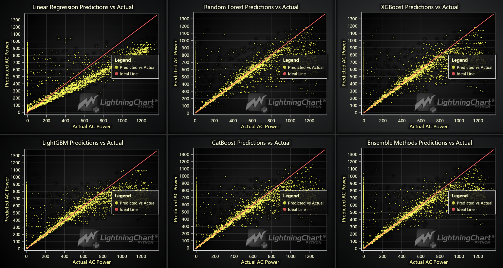

# Implementation of a Solar Power Modelling Application with LightningChart Python

## Introduction

Solar power modeling is a computational approach that helps in predicting and optimizing the performance of solar energy systems. It involves the use of mathematical and simulation models to forecast the power output of solar panels under various environmental and operational conditions. By understanding and anticipating the behavior of solar power systems, engineers and researchers can design more efficient solar energy installations, maximize energy production, and reduce operational costs (Tripathi et al., 2024).

One of the primary ways solar power modeling contributes to system optimization is through the accurate prediction of power output. By analyzing historical weather data and real-time environmental inputs, solar power models can forecast daily, monthly, and annual energy yields. This allows operators to make informed decisions regarding energy storage, grid integration, and maintenance schedules, ensuring the system operates at peak efficiency (Al-Shahri et al., 2021).

Several critical variables are required for accurate solar power modeling, including:
- **Solar Irradiance**: The amount of solar energy received per unit area at a given location. It is a crucial factor influencing the energy production of solar panels.
- **Temperature**: Both ambient and module temperatures affect the efficiency of solar panels. High temperatures can reduce the efficiency, while lower temperatures might enhance it, depending on the panel type.
- **Panel Orientation**: The angle and direction in which solar panels are installed significantly impact the amount of sunlight they receive, thus affecting their power output.
- **Shading**: Obstructions such as buildings, trees, or other structures that cast shadows on solar panels can reduce the energy output by blocking sunlight.
- **System Specifications**: These include the technical characteristics of the solar panels, inverters, and other system components, which determine the overall efficiency and performance of the solar power system.

Solar power modeling is applied in various fields, including residential and commercial solar energy projects, large-scale solar farms, and grid integration studies. It is also used for policy-making, financial analysis, and in the development of renewable energy solutions to ensure sustainable energy production.

## LightningChart Python

### Overview of LightningChart Python

LightningChart Python is a powerful tool for creating high-performance, interactive data visualizations. It supports various chart types and is particularly well-suited for real-time data applications. This project leverages LightningChart's capabilities to visualize solar power data, including scatter plots, bar charts, and 3D surface plots, making it an excellent choice for Python energy and power system analysis.(LightningChart Python API Reference, n.d.)

### Features and Chart Types to be Used in the Project

For this project, we'll leverage several powerful features of LightningChart to model and visualize solar power generation data effectively:

- **Scatter Plot Series (ChartXY)**: Visualizing relationships between variables like AC Power vs. Time, Irradiation, and Temperature.
- **Bar Charts**: Illustrating feature importance as determined by machine learning models.
- **Area Charts**: Analyzing the distribution of key features like Daily Yield and Module Temperature.
- **3D Surface Plots**: Exploring interactions between multiple variables.
- **Gauge Charts**: Real-time predictions of ambient and module temperatures.

### Performance Characteristics

LightningChart is renowned for its exceptional performance, capable of handling and rendering large datasets with high precision and speed. This performance is crucial when dealing with solar power data, which often includes millions of data points collected over extended periods. LightningChart's ability to deliver real-time updates and detailed visualizations makes it an ideal choice for solar power modeling, ensuring that users can analyze complex data without performance bottlenecks.

## Setting Up the Python Environment

### Installing Python and Necessary Libraries

To get started, ensure you have Python installed. Here you can see how to install the following libraries:

```bash
pip install lightningchart==0.7.2.1
pip install numpy pandas sklearn xgboost lightgbm catboost
```

Ensure you have Python installed on your system. The following libraries are essential for this project:
- **NumPy**: Numerical operations and handling arrays.
- **Pandas**: Data structures and data analysis tools.
- **LightningChart**: High-performance data visualizations.
- **XGBoost, LightGBM, CatBoost**: Advanced machine learning algorithms.
- **Scikit-learn**: Implementing machine learning models.
- **Scipy**: Statistical functions like density estimation.
- **Scikit-learn**: Implementing machine learning models.
- **pvlib**: Provides tools for simulating and modeling photovoltaic (PV) energy systems, including solar position, irradiance, and power output calculations.
- **time**: A Python standard library for handling time-related tasks.

### Setting Up Your Development Environment

1. **Set up your development environment by creating a virtual environment and installing the necessary libraries. This ensures that your project dependencies are isolated and manageable.
   
   ```bash
   python3 -m venv venv
   source venv/bin/activate  # On Windows use `venv\Scripts\activate`
   pip install -r requirements.txt
   ```

2. **Using Visual Studio Code (VSCode)**: Visual Studio Code is a popular code editor that offers a rich set of features to enhance your development workflow.

## Data Handling and Preprocessing

### Loading and Processing Data

### How to Load the Data Files

The data used in this project includes solar power generation data and weather sensor data. These datasets are merged based on timestamps to align power generation metrics with environmental conditions. The merged data is then prepared for analysis by selecting relevant features such as daily yield, total yield, ambient temperature, and module temperature.(Solar Power Generation Data, n.d.)

``` python
import pandas as pd
generation_data = pd.read_csv('Dataset/Plant_2_Generation_Data.csv')
weather_data = pd.read_csv('Dataset/Plant_2_Weather_Sensor_Data.csv')
```
### Handling and Preprocessing the Data

To prepare the data for analysis and modeling, we followed these steps:

1.	Loading Data: The data was loaded using Pandas, which allows for efficient data manipulation and inspection.
2.	Merging Datasets: We merged the generation data with the weather sensor data based on the DATE_TIME and PLANT_ID columns to ensure that each record had corresponding weather and generation information.
3.	Datetime Conversion: The DATE_TIME columns were converted to datetime objects to facilitate time-based analysis.
4.	Feature Selection: Key features like DAILY_YIELD, TOTAL_YIELD, AMBIENT_TEMPERATURE, and MODULE_TEMPERATURE was selected for further analysis.
5.	Data Cleaning: Missing values were handled, and irrelevant features were dropped to ensure the dataset was clean and focused on the necessary attributes for modeling.
6.	Normalization: Feature scaling was applied using StandardScaler to normalize the data, making it suitable for machine learning algorithms.

## Visualizing Data with LightningChart

### Introduction to LightningChart for Python

LightningChart provides an efficient way to visualize large datasets in real-time, which is crucial for applications like sonar object recognition.

### Creating the Charts

## Scatter Plots and Time Series Analysis: 
The first set of diagrams focuses on the relationship between AC power and various factors such as time, irradiation, module temperature, ambient temperature, daily yield, and total yield. These scatter plots help visualize the distribution and correlation between these variables, crucial for understanding how environmental factors influence solar power output.
Script Summary: The scatter plots were generated using the following script, which creates charts for each pair of variables:

``` python
def create_scatter_chart(dashboard, title, x_values, y_values, xlabel, ylabel, column_index, row_index):
    chart = dashboard.ChartXY(column_index=column_index, row_index=row_index)
    chart.set_title(title)
    scatter_series = chart.add_point_series().add(x_values, y_values).set_point_color(lc.Color(0, 0, 255, 128)).set_point_size(2)
    chart.get_default_x_axis().set_title(xlabel)
    chart.get_default_y_axis().set_title(ylabel)
```


These scatter plots reveal the following insights:
•	AC Power vs. Time: Displays a clear diurnal pattern with peaks around midday, indicating the correlation between sunlight availability and power output.
•	AC Power vs. Irradiation: Shows a strong positive correlation, confirming that higher solar irradiance leads to increased power generation.
•	AC Power vs. Module Temperature: Indicates a direct relationship, with power output increasing as module temperature rises, up to a certain point.
•	AC Power vs. Ambient Temperature: Also shows a positive correlation, though less pronounced than with module temperature.
•	AC Power vs. Daily Yield and Total Yield: These plots show that higher cumulative yields are associated with higher power outputs.

## Feature Importance Analysis: 

The second set of diagrams analyzes feature importance using various machine learning models, including Linear Regression, Random Forest, XGBoost, LightGBM, CatBoost, and Ensemble Methods. These bar charts visualize the importance of each feature in predicting AC power.
Script Summary: The feature importance was extracted from each model and plotted as follows:

``` python
def add_feature_importance_to_dashboard(dashboard, model_name, importances, column_index, row_index):
    importance_df = pd.DataFrame({'Feature': features.columns, 'Importance': importances}).sort_values(by='Importance', ascending=False)
    chart = dashboard.BarChart(column_index=column_index, row_index=row_index).set_title(f'{model_name} Feature Importances')
    bar_data = [{'category': str(row['Feature']), 'value': float(row['Importance'])} for _, row in importance_df.iterrows()]
    chart.set_data(bar_data)
```


Key observations include:
•	Irradiation consistently emerges as the most significant feature across models, emphasizing its critical role in predicting power output.
•	Ambient Temperature and Module Temperature also contribute, though to a lesser extent.

## Grid Layout of Density and Scatter Plots: 

This diagram is a grid layout combining multiple density and scatter plots, offering a detailed analysis of the interactions between key variables such as DAILY_YIELD, TOTAL_YIELD, AMBIENT_TEMPERATURE, and MODULE_TEMPERATURE. Each cell in the grid shows either a scatter plot or a density plot, depending on whether the variables being compared are different or the same.
Script Summary: The grid layout was created using the following script:

``` python
def create_density_scatter_grid(merged_data):
    dashboard = lc.Dashboard(rows=len(features), columns=len(features), theme=lc.Themes.Dark)
    for row_index, y_col in enumerate(features):
        for column_index, x_col in enumerate(features):
            if row_index == column_index:
                values_dict = {key: merged_data[merged_data['SOURCE_KEY_x'] == key][x_col].astype(float).tolist() for key in source_keys}
                create_density_chart(dashboard, f'Density of {x_col}', values_dict, column_index, row_index)
            else:
                data_dict = {key: (merged_data[merged_data['SOURCE_KEY_x'] == key][x_col].astype(float).tolist(),
                                   merged_data[merged_data['SOURCE_KEY_x'] == key][y_col].astype(float).tolist()) for key in source_keys}
                create_scatter_chart(dashboard, f'{x_col} vs {y_col}', data_dict, x_col, y_col, column_index, row_index)
    dashboard.open()
```


Insights include:
•	Density Plots: Provide an understanding of the distribution for each key variable independently, highlighting how values are spread across the dataset.
•	Scatter Plots: Reveal the relationships between pairs of variables, showing how one variable impacts another. For instance, how AMBIENT_TEMPERATURE affects DAILY_YIELD.
•	Comprehensive Visualization: The grid layout offers a complete view, making it easy to identify correlations, trends, and outliers across multiple variables at a glance.

## Predictions vs. Actuals: 

The third set of diagrams compares the predicted AC power against actual values using various models. This is crucial for evaluating model accuracy.
Script Summary: This comparison is visualized through scatter plots of predicted vs. actual values, including an ideal line for reference:

``` python
def add_prediction_vs_actual_to_dashboard(dashboard, model_name, model, column_index, row_index):
    pipeline.fit(X_train, y_train)
    y_pred = pipeline.predict(X_test)
    chart = dashboard.ChartXY(column_index=column_index, row_index=row_index).set_title(f'{model_name} Predictions vs Actual')
    pred_series = chart.add_point_series().add(y_test.tolist(), y_pred.tolist()).set_point_size(2)
    line_series = chart.add_line_series().add([min_val, max_val], [min_val, max_val]).set_line_color(lc.Color(255, 102, 102))
```



Results indicate that:
•	Most models perform well, with predictions closely aligned with actual values.
•	Ensemble Methods slightly outperform individual models, suggesting the benefits of combining multiple algorithms.

## 3D Surface and Scatter Plots: 

The next diagrams include 3D visualizations that provide a more comprehensive view of how different variables interact to influence daily yield and power output.
Script Summary: 3D surface and scatter plots were generated using the following scripts:

``` python
def create_3d_surface_chart(merged_data):
    chart = lc.Chart3D(theme=lc.Themes.Dark, title='3D Surface of DAILY_YIELD vs MODULE_TEMPERATURE and AMBIENT_TEMPERATURE')
    surface_series = chart.add_surface_grid_series(columns=grid_z.shape[1], rows=grid_z.shape[0])
    surface_series.set_start(x=x_values.min(), z=y_values.min()).set_end(x=x_values.max(), z=y_values.max()).invalidate_height_map(grid_z.tolist())
    chart.get_default_x_axis().set_title('MODULE_TEMPERATURE')
    chart.get_default_y_axis().set_title('DAILY_YIELD')
    chart.get_default_z_axis().set_title('AMBIENT_TEMPERATURE')
    chart.add_legend(data=surface_series)
```


Insights include:
•	3D Surface Plot shows the combined effect of module and ambient temperatures on daily yield, with clear peaks where optimal conditions are met.
•	3D Scatter Plot uses color coding to visualize how daily yield varies with module and ambient temperatures.

## Real-Time Solar Movement with Energy Efficiency Gauge: 

This implementation showcases a real-time dashboard that visualizes solar movement in 3D, while displaying energy efficiency and module temperature using dynamic gauge.:


``` python
def create_solar_dashboard(data, latitude, longitude):
    solpos = pvlib.solarposition.get_solarposition(data['DATE_TIME'], latitude, longitude)
    data['solar_azimuth'], data['solar_altitude'] = solpos['azimuth'].values, solpos['apparent_elevation'].values
    data = data[data['solar_altitude'] > 0]

    dashboard = lc.Dashboard(theme=lc.Themes.Dark, rows=2, columns=3)
    efficiency_gauge = dashboard.GaugeChart(row_index=0, column_index=0).set_title('Energy Efficiency').set_interval(0, 1)
    module_gauge = dashboard.GaugeChart(row_index=0, column_index=2).set_title('Module Temperature').set_interval(0, 60)
    chart_solar_movement = dashboard.Chart3D(row_index=0, column_index=1).add_point_series().set_point_shape('sphere').set_point_size(10.0)
    chart_energy = dashboard.ChartXY(row_index=1, column_index=0, column_span=3).add_line_series().set_name('AC Power')

    for i, row in data.iterrows():
        solar_series.add([row['solar_azimuth']], [row['solar_altitude']], [row['DATE_TIME'].timestamp() * 1000])
        chart_energy.add(row['DATE_TIME'].timestamp() * 1000, row['AC_POWER'])
        efficiency_gauge.set_value(row['AC_POWER'] / (row['IRRADIATION'] * 1385.42) if row['IRRADIATION'] > 0 else 0)
        module_gauge.set_value(row['MODULE_TEMPERATURE'])
        time.sleep(0.2)
```


Insights include:
•	3D Solar Movement: The 3D chart visualizes the sun's path across the sky by plotting azimuth and altitude over time.
•	Energy Efficiency Gauge: The gauge provides real-time feedback on the efficiency of solar panels, helping monitor performance.
•	Module Temperature Gauge: This gauge tracks the module temperature, indicating potential impacts on energy efficiency.
•	Real-Time Visualization: The dashboard simulates real-time data streaming, making it a powerful tool for dynamic analysis of solar energy systems.

## Real-Time Dashboard with Gauges: 

The final dashboard integrates real-time data visualization, with gauges displaying current ambient and module temperatures, and a line chart tracking predicted AC power over time.
Script Summary: The gauges and line chart are updated in real-time based on simulated data:


``` python
def update_dashboard():
    for i in range(1000):  
        predicted_values = []
        time_values = []
        random_weather = generate_random_weather_data()
        predicted_power = model.predict(pd.DataFrame([random_weather]))[0]
        Area_series.add(time_values[-1], predicted_values[-1])
        ambient_gauge.set_value(random_weather['AMBIENT_TEMPERATURE'])
        module_gauge.set_value(random_weather['MODULE_TEMPERATURE'])
        time.sleep(0.5)
```


This visualization:
•	Gauges offer a real-time view of temperature conditions, essential for monitoring system performance.
•	Line Chart provides a continuous update of power predictions, useful for dynamic analysis.


## Conclusion

This project demonstrates the power of using Python, specifically LightningChart, for solar power generation prediction and analysis. By visualizing data in diverse and interactive ways, deeper insights can be gained into the factors influencing solar power output, optimizing performance, and ensuring accurate predictions.

## Benefits of Using LightningChart Python

- **High Performance**

LightningChart is optimized for rendering large datasets quickly and efficiently. This is crucial when dealing with extensive solar power data, as seen in the scatter and density plots where thousands of data points are visualized without any lag or performance issues.

- **Comprehensive Visualization Capabilities**

The variety of chart types, including scatter plots, density plots, bar charts, and 3D visualizations, allows for a thorough exploration of data from multiple angles. This versatility is demonstrated in the article’s diagrams, where complex relationships between variables such as AMBIENT_TEMPERATURE, MODULE_TEMPERATURE, and DAILY_YIELD are clearly visualized.

- **Customization and Flexibility**

LightningChart provides extensive customization options, enabling the creation of tailored visualizations that meet specific project needs. In this project, features like customized axis labels, color gradients, and grid layouts were easily implemented, enhancing the clarity and effectiveness of the visual analysis.

- **Real-time Data Handling**

For applications requiring real-time monitoring, such as the dynamic gauge and line charts for temperature and power predictions, LightningChart offers robust support for live data updates. This makes it particularly valuable for ongoing solar power generation monitoring and optimization.

- **Interactive 3D Visualizations**

The ability to create interactive 3D visualizations, such as the surface and scatter plots used to analyze the effects of temperature on yield, adds an extra dimension to data analysis. These visualizations help in uncovering insights that might not be as apparent in 2D charts.
Overall, LightningChart Python proves to be a powerful tool for solar power modeling, providing the performance, flexibility, and depth needed to thoroughly analyze and optimize solar energy systems.(LightningChart® Python Charts for Data Visualization, 2024)


## References

- Al-Shahri, O. A., et al. (2021). Solar photovoltaic energy optimization methods, challenges and issues: A comprehensive review. *Journal of Cleaner Production*, 284, 125465.
- Bönke, W., et al. (2024). Data augmentation for 3D seismic fault interpretation using deep learning. *Marine and Petroleum Geology*, 162, 106706.
- LightningChart® Python charts for data visualization. (2024, March 7). https://lightningchart.com/python-charts/
- LightningChart Python API Reference. (n.d.). Retrieved May 31, 2024, from https://lightningchart.com/python-charts/api-documentation/
- Solar Power Generation Data. (n.d.). Retrieved September 2, 2024, from https://www.kaggle.com/datasets/anikannal/solar-power-generation-data
- Tripathi, A. K., et al. (2024). Advancing solar PV panel power prediction: A comparative machine learning approach in fluctuating environmental conditions. *Case Studies in Thermal Engineering*, 59, 104459.
